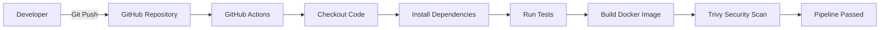

🚀 Secure CI/CD Pipeline with GitHub Actions & Trivy
📌 Overview

This project demonstrates a modern DevSecOps workflow by building a containerized Python Flask application and automating testing, Docker image creation, and vulnerability scanning using GitHub Actions and Trivy.

The pipeline automatically validates application functionality, builds a Docker image, scans it for known vulnerabilities, and reports the results before the build is considered successful.

✨ Features
Containerized Flask REST API
Automated CI pipeline using GitHub Actions
Docker image build automation
Automated endpoint testing using pytest
Container vulnerability scanning using Trivy
Security-first CI workflow
🛠 Tech Stack
Category	Technology
Language	Python
Framework	Flask
Containerization	Docker
Version Control	Git
Repository	GitHub
CI/CD	GitHub Actions
Testing	pytest
Security	Trivy

## Architecture

